# ASM_HW2

ИДЗ №2 по АВС выполнил студент БПИ219 Талалаев Геннадий

Мой вариант представлен ниже:

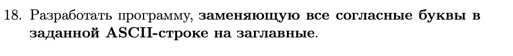

---
**Ограничения ввода:**
1) Вводится строка, содержащая n (n <= 1 000 000) символов ASCII-таблицы . Для конца ввода нажать Сtrl+D
3) Если длина массива строки равна 0, то вывод пустой
4) Программа принимает на вход строку.
---
## 4 балла
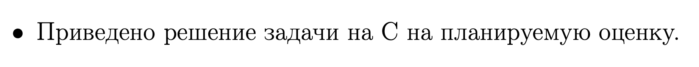
 - main.c
---
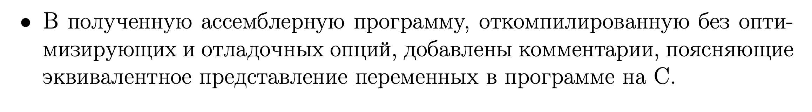

- Компиляция без отладочных опций:


- После компиляции создался файл first.s
---


- Использованы аргументы командой строки и ручное редактирование, получился файл second.s

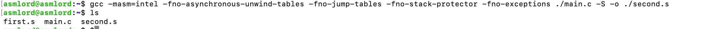

---
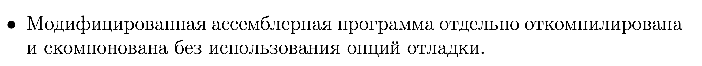

- Программа скомпилирована и скомпонована без опций отладки

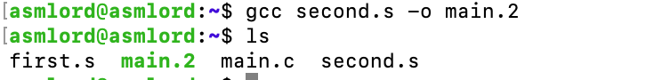

---


**Тесты**


1) Ввод: 
```
qwertyuiopasdfghjklzxcvbnm
```

Предполагаемый вывод:
```
QWeRTyuioPaSDFGHJKLZXCVBNM
```

Вывод программы на C:

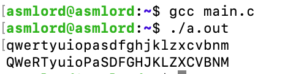

Вывод программы на GAS:

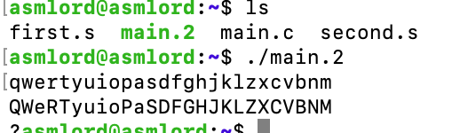
---
2) Ввод: 
```
Hello world!
```

Предполагаемый вывод:
```
HeLLoW WoRLD!
```

Вывод программы на C:

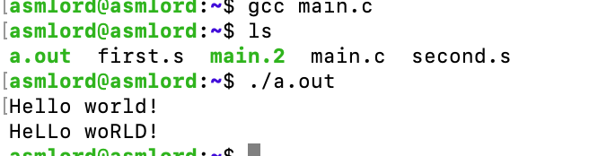

Вывод программы на GAS:

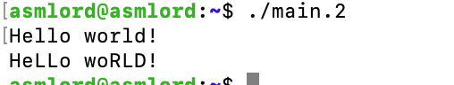
---
3) Ввод: 
```
qwerqwetqwteqwt jfsnjfnss
ksadokaskodasod asdksadnka
qiwejisajdsinsa dasjfnsad
```

Предполагаемый вывод:
```
QWeTQWEeTQWETeQWT JFSNJFNSS
KSaDoKaSKoDaSoD aSDKSaDNKa
QiWeJuSaJDSuNSa DaSJFNSaD
```

Вывод программы на C:

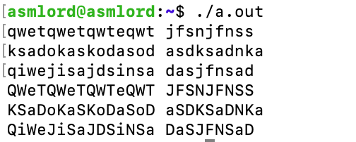

Вывод программы на GAS:

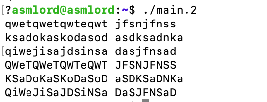
---
4) Ввод: 
```

```

Предполагаемый вывод:
```

```

Вывод программы на C:

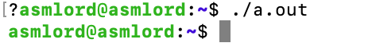

Вывод программы на GAS:

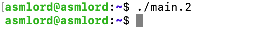
---
5) Ввод: 
```
123456789
```

Предполагаемый вывод:
```
123456789
```

Вывод программы на C:

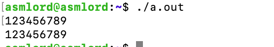

Вывод программы на GAS:

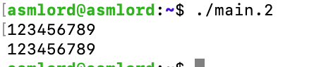
---

---
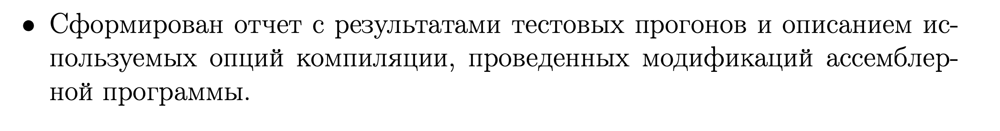

- Отчёт сформирован.
---
## 5 баллов

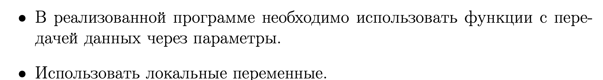

- Функции с передачей данных через параметры использованы (файл main.c)

```
bool check_if_consonant(char el, int size) {
    char consonants[] = {'b', 'c', 'd', 'f', 'g', 'h', 'j', 'k', 'l', 'm', 'n', 'p', 'q', 'r', 's', 't',
                         'v', 'w', 'x', 'z'};
    for (int i = 0; i < size; i++) {
        if (consonants[i] == el) {
            return true;
        }
    }
    return false;
}
void swap_consonant(char str[], int size) {
    for (int i = 0; i < size; i++) {
        if (check_if_consonant(str[i], size)) {
            str[i] = str[i] - 32;
        }
    }
    for (int i = 0; i < size; i++) {
        printf("%c", (char) str[i]);
    }
}
```

---
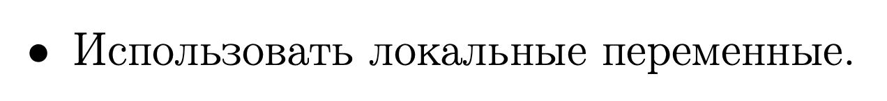

- Локальные переменные использованы(i, ch, size, str[1000000]). Это можно увидеть в файле main.c
```
    char str[1000000];
    int i = 0;
    int ch;
    int size = 0;
```
---

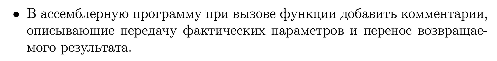
-   В ассемблерную программу при вызове функции добавлены комментарии, описывающие передачу фактических параметров и перенос возвращаемого результата. Это можно увидеть в файле second.s
---

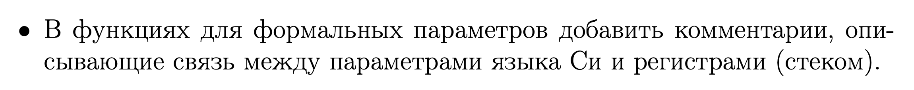
-    В функциях для формальных параметров добавлены комментарии, описывающие связь между параметрами языка Си и регистрами (стеком). Это можно увидеть в фале second.s
---

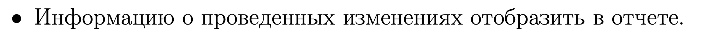

- Информация добавлена в отчёт
